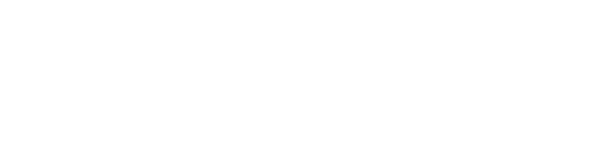

  <picture width="400px">
    <source media="(prefers-color-scheme: dark)" srcset="./assets/sonaptics_black.png">
    
  </picture>

  &middot;
  <i>Junction 2024 Hackathon Project</i>
  &middot;

## Description

> Sonaptics: Touch-Free Alerts, Waste-Free Operations

We often take communication for granted, but in certain settings, being unable to communicate effectively can become a significant problem. This is especially true in industrial environments where safety, sanitation, and speed are paramount.

**HKFoods**, one of the largest food producers in Finland, faces a challenge that costs millions of euros each year in food waste: communication limitations among factory workers. These limitations arise from factors such as noise, language barriers, and the restrictions of safety protocols.

Food industry standards demand the highest levels of sanitation in production facilities. Workers must wear full protective gear and are prohibited from bringing personal items into production areas. Additionally, factory environments are extremely loud, and employees are confined to their designated workstations, making mobility and direct interaction difficult.

These constraints lead to a costly issue: when a problem occurs on the production line, workers cannot quickly communicate with colleagues and managers, resulting in delays where all products made during the issue must be discarded. Traditional communication methods fall short in these environments where phones and wearable devices are not allowed, and touch screens need constant sanitizing.

To address these challenges, we developed Sonaptics, a touchless communication system designed specifically for such environments. Our solution:

- Works seamlessly even when employees are in full safety gear
- Is accessible from every workstation in the factory
- Requires no language skills to operate, breaking down communication barriers between workers of different backgrounds and regions

By offering a touchless, intuitive solution that works in noisy, highly regulated settings, Sonaptics enables workers to communicate effectively without the need for language proficiency, ensuring smoother operations and a safer, more productive workplace.

## Technical Approach

The Sonaptics system, built to facilitate touchless communication in noisy, high-sanitation environments, is designed using a combination of responsive UI, real-time data transfer, and hardware integration.

### Key Features

- **Intuitive UI with React and Framer Motion**: The user interface, created with React and enhanced by Framer Motion for smooth animations, ensures ease of use even with full safety gear, allowing clear visual feedback for quick actions.
- **Real-Time Event Handling via WebSocket**: A WebSocket connection facilitates instant communication between the user’s device and the central server, ensuring rapid response times essential in fast-paced production settings.
- **Python-Driven Backend for Hardware Integration**: The backend, developed in Python, handles communication with sensors and other hardware, ensuring seamless data flow between the devices and the UI.
- **Gesture Recognition with Movement Sensors**: The hardware system comprises motion sensors that recognize specific gestures. This allows workers to swipe left, swipe right, or hold their hands in front of the sensors for 3 seconds to confirm an action—eliminating the need for physical touch and supporting effortless, sanitary communication.

Through this approach, **Sonaptics** enables reliable, real-time communication that overcomes the physical and environmental barriers in factory settings, ultimately reducing waste and improving efficiency.

## Post-Junction Roadmap

While **Sonaptics**'s solution is already transforming communication in production facilities, it focuses on delivering a touchless prototype first. The next phase will introduce additional features to further enhance **Sonaptics** and align with the goals of HKFoods in improving sustainability, inclusivity, quality control, and real-time monitoring. Below are some key enhancements and features to be integrated in the future:

### Key Features for Future Development:

- **Waste Reduction Reporting**: Integrate features that monitor material wastage in real-time, tracking scrap production or excessive raw material use. By visualizing waste data, workers and managers get more engaged and can take proactive steps to optimize material usage and reduce waste throughout the production process.
- **SMS Notifications for Managers**: A system that sends real-time SMS alerts to managers, including the station ID where an error was detected. This feature will ensure that managers can respond quickly to any issue, minimizing delays and reducing food waste.
- **Alert Monitors in Key Locations**: Deploy alert monitors throughout the facility, offering real-time visibility of current system alerts. This will ensure that all team members, even those away from their workstations, are kept informed of critical issues.
- **Sound and Light Alerts**: Integrate sound and light indicators in key places within the facility, directly linked to the Sonaptics system. These visual and auditory signals will provide immediate alerts to staff, helping them take action even in noisy environments, ensuring that no important information is missed.
- **Environmental Impact Dashboard**: Add a sustainability feature that tracks the environmental impact of production activities, including energy use, carbon footprint, and waste metrics. This feature will align with HKFoods’ sustainability goals by helping to reduce the carbon footprint of their operations and optimize resource use.

## Conclusion

At **Sonaptics**, our primary focus was on developing a **touchless prototype** to address the immediate communication challenges faced by workers in noisy, high-sanitation environments. With this core system in place, we are now planning to enhance the product further by incorporating advanced features that align with HKFoods’ goals of sustainability, efficiency, inclusivity, and proactive production management.

The next phase will integrate predictive monitoring, advanced waste reduction tools, and real-time quality control features, ensuring that Sonaptics can move beyond reactive problem-solving and become a proactive tool for managing food production processes. By continuing to build on our **touchless communication system**, we aim to help HKFoods maintain high product quality, minimize waste, and optimize operations across their entire production chain.
